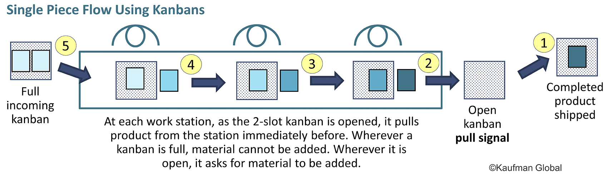
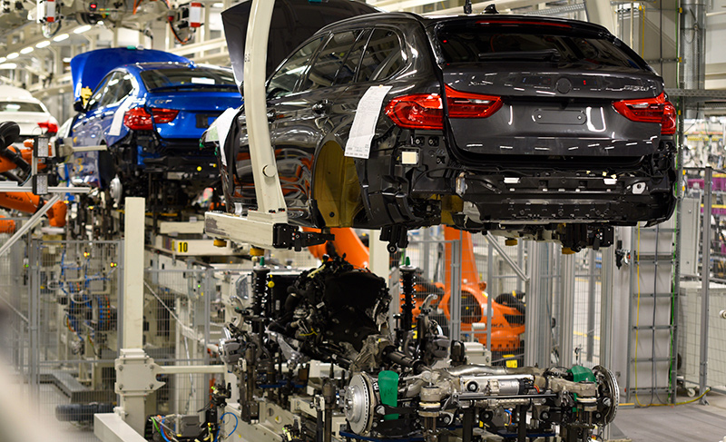
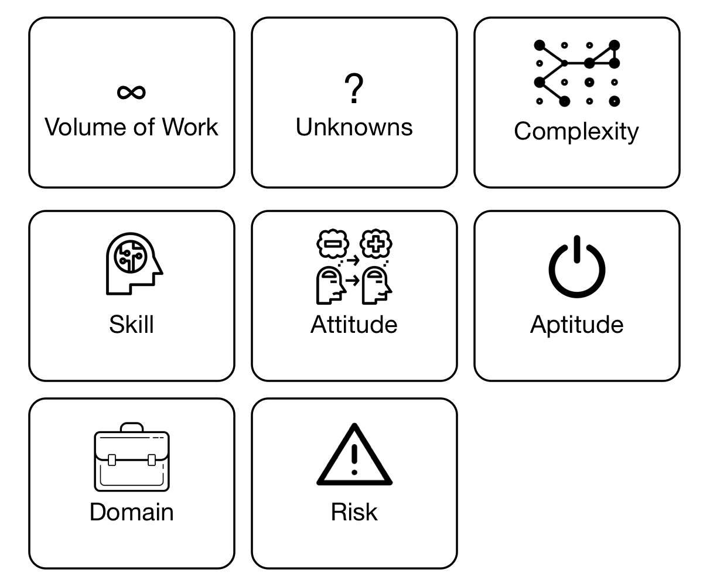

# Strengthening your Agile practice by introducing Lead and Cycle Time

## Abstract
...
## Introduction

Agile methodologies such as Scrum, Extreme Programming and DSDM have emerged in the 1990s and most of them were inspired by the lean manufacturing movement. Majority of the methodologies follow similar values but are delivered in a different way. Unfortunately Agile methodologies are experiencing the following problems:
1. They were inspired by the manufacturing industry, software engineering is not manufacturing as it follows different paradigm. This renders some of the lean techniques not as effective in knowledge work. 
1. Multitude of key performance indicators make it hard to realise what is the "key" indicator further reinforcing entropy. Additionally KPIs usually don't provide any very much needed insight in to what needs to be done to improve operations. This is because focus is on methods and not the results. 
1. As they are so prescriptive new practitioners have to spend a lot of time practicing Agile methods. After a lot of practice they can follow rules and understand what needs to be done, but not why they are doing it. 
1. They value **how** you work (methods) over what gets the results, this makes it very hard to understand what needs to be changed to make methodology work for your particular environment. 
1. They need to integrate with the whole business way beyond Software Engineering, this includes Marketing, Sales, Customer support, etc. Due to difficulty in achieving this, department's choose to keep their improvements to themselves, leading to a local optimisation, meaning organisation as a whole fails to get overall benefits. 
1. Term agile is not well defined, it is hard to understand what is meant when stakeholders say "we have to be more Agile" or "we need to change our process to be more Agile".
1. In time entropy erodes established best practice, making practitioners lose their "true north" bearings. It also makes it really difficult or not even possible to go back to "true north" if stakeholders lose faith in the existing process. 

Above problems have been witnesses by me directly and indirectly across various software engineering departments in the industry. In this article I will explore how above problems can be remedied through introduction of lead and cycle time. 

## Alternative perspective 
In this section I will explore how your existing agile operations can be viewed from a different angle, and why we as practitioners have been experiencing above problems.

### Knowledge work is not manufacturing 

Agile methodologies do borrow ideas from lean manufacturing and engineering. While some ideas such as standards, components, trunk based development, and value streams have been very useful, others such as Kanban, Theory of Constraints (ToC),  Little's Law and One piece flow get applied wrongly. As a practitioner I have immersed myself in these concepts reading "Agile Management for Software Engineering" and "Phoenix Project" and for a while I was under impression that these concepts were working. Only after some reflection it became evident that these ideas did not work as expected, they actually ended up slowing delivery operations which lead towards a lot of frustration. In this section we will explore why exactly ToC, Little's Law and one-piece flow can't be applied literally and need to be considered from an alternative angle.

I am not an expert in manufacturing, so this section's examples should be taken as high level ideas that serve as a contrast to knowledge work.

#### Manufacturing 

Since the rise lean manufacturing majority of companies have transitioned towards one-piece flow. This is where work travels in discrete pieces from station to station where some operation is applied on to it such as:

(Image taken from https://www.kaufmanglobal.com/glossary/single-piece-flow/)

This means that factory's tend to have one assembly line down which work travels. Takt dictates how much time each station has to complete their task. For example in car manufacturing, you might need to install car dashboard, you will be given 3 minutes per car to do this. If you find an issue, don't have enough time, you can "stop the line" so the entire assembly line stops. 

(Charlie Chaplin "Modern Times" 1936 movie)

Car manufacturers have been doing this for decades so they have figured out ways to ensure that each station has as few issues as possible so there is very little disruption. As you can imagine work is monotonous, however quality people are needed, so these assembly line workers tend to get paid well (in the UK). 

Assembly lines can get very long and they might have number of inputs before the work gets merged in to a single line. This can be witnessed when car manufacturers perform "marriage", this is when they insert the chassis, transmission and engine in the body on the production line. 

(image taken from https://www.sar.biz/news/2017_Aggregateeinbau_BMW_e.asp)

Lastly all of the cars are not the same. They will be built per different specifications. Some will have premium interior, different wheels, upgraded electronics and so on. This means each stage needs to know what exactly needs to be done for that particular car. This adds additional complexity to the manufacturing process. 

Now that we know some of the pertinent details we can explore why **assembly line work** is different to **knowledge work**.  

#### Standard work (Assembly Line)
What gave a drastic productivity boost to assembly line is componentisation. It became possible to put things together using discrete parts. Componentisation and part integration is possible only through agreed standards. Assembly line is setup and configured to produce few models of the car, sure these models have different variants like mentioned above, however they are all standard and their **Takt time is known**. 

#### Non standard work (Craft production)
Now contrast this to software engineering. Typical backlog of user stories delivers discrete piece of value, we will call them story A, B and C. Story A might take 15 days to complete by 4 people. B might take 5 days to complete by 2 people. C might take 8 days to complete by 7 people from 3 different departments! In some sense this is craft production.  

Practitioner might say, well how about you break these user stories down to a smaller size? So that Takt time is known. I have to counter with, user story needs to be a discrete piece of value. If it is possible to break it down and still delivery **real value** then it should be broken down. However more often then not user story can only be broken down to a finite amount until it **loses its value** and then process becomes task break down. Breaking user stories down too far is artificial and actually leads to knowledge workers forgetting why they are doing the piece of work in the first place, this leads to poorer solutions and time waste (more on that later).

This is not to say that there is no standard work in knowledge work. Implementations consultants that are setting up a product for a customer are doing standard work. Software engineers that are re-using components and connecting them to a different data source are doing standard work. However the problem is that companies want innovation and product differentiation. Unfortunately this work falls in to craft production which is slower and tends to be less predictable. 

#### Anatomy of knowledge work

Craft production delivery predictability is exacerbated by the fact that **people** are working on the actual work. Stakeholders in organisations forget that employee A and employee B might deliver work at very different speed due to their different characteristics and experience. Also work it self might have properties that were not considered until development starts. Here are the factors that impact productivity:

* Volume of work - This is the amount of work you have to do. 
* Unknowns - This is you identifying stuff that you did not consider when you were estimating the work.
* Complexity - This is you figuring out an algorithm to solve a problem, the main thinking part. 
* Risk - This is how much testing you have to do given the risk level that is acceptable for the task at hand.
* Skill - This is you improving your hard/soft transferable skills (programming, math, architecture, algorithm design, management, etc) or using your existing skills to get work done quicker.
Domain - This is you gaining new domain knowledge (HR, Logistics, Financial Trading, etc) or using your existing domain knowledge to get work done faster.
* Attitude - This is how you perceive your work environment and tasks.
* Aptitude - This is you having developed or have predisposed skills towards the work that you are doing.

#### Work swapping

Assembly lines tend to be linear. Once work enters the production line it goes from start to the end in the queue fashion. This is not the case with knowledge work. Work might go on to a backlog sit there for a year and then be removed. Work that was super urgent will be deprioritised. In knowledge work there is no queue as such. If you are following Scrum then normally team commits to work before a Sprint starts and very rarely should user stories in the Sprint change. This commitment is probably the only place in the whole process where there is a stable queue. 

#### Implications

Rest of this article explores implications of the above. However few things will be pointed out at this stage:
1. **Little's Law** assumes that queue is stable and that work has an average cycle time. This is true for standard work, not true for craft production. This means vanilla Little's Law can't be used for software engineering. 
1. **One-piece flow**, typical Scrum team has around 6 team members. It is likely that they will work on more then user story at the time. This means it is not one-piece flow. Constraining team to a one piece flow artificially constraints teams and wastes capacity.
1. **Theory of constraints** assumes that there is one-piece flow and work is standard. Different stories will engage different people in the team at different times. This means bottleneck is dynamic and it depends on the work that team is working on. 

One big insight that we can gain already is that in knowledge work the **work it self** can be a constraint. This is because in knowledge work as a business you choose:
* What you do
* How you choose to do it
* Who does it

This means if you have a creative product owner or business analysts they deliver astronomical amount of value with a very small team. If this does not make sense yet, keep reading.

### What is actually important to measure 
...

#### Lead Time 
...
#### Cycle Time
...

### Knowledge workers workflow 
...

#### Your work
...

#### How your team works
...

### Learning to focus on results not methods

#### How your team would work 
...

#### Use retrospective to gain qualitative insight 
...

#### Use data to gain quantitative insight  
...

## Alternative perspective in practice
...

...
## What are the implications of this perspective
...
## Conclusions 
...
## Acknowledgments
...