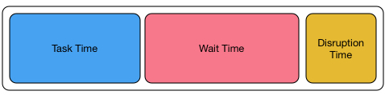
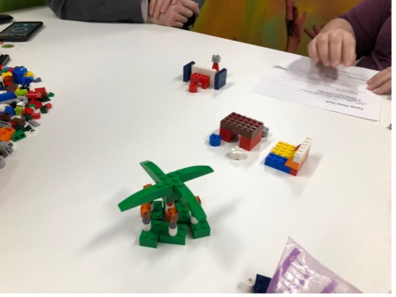
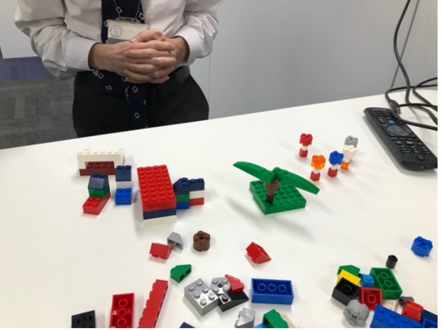
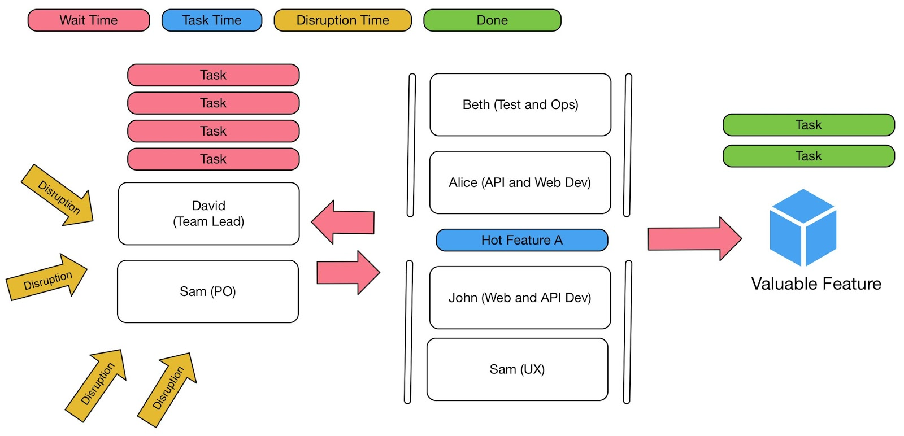

# Rejuvenating Agile operations by putting Lead and Cycle Time front and center

## Contents
* [Abstract](#abstract)
* [Introduction](#introduction)
* [Knowledge work is not Manufacturing](#manufacturing-is-not-knowledge-work)
    * [Manufacturing](#manufacturing)
    * [Standard work - Assembly Line](#standard-work-assembly-line)
    * [Non-standard work - Craft production](#non-standard-work-craft-production)
    * [What makes up knowledge work](#what-makes-up-knowledge-work)
    * [There is no single queue](#there-is-no-single-queue)
    * [Implications on existing best practices](#implications-on-existing-best-practices)
* [Goals are still the same](#goals-are-still-the-same)
    * [Cycle Time](#cycle-time)
    * [Lead Time](#lead-time)    
* [Craft Production - Work Flow](#knowledge-work-work-flow)
    * [Your individual work](#your-individual-work)
    * [Optimised by department](#optimised-by-department-team-work)   
    * [Optimised by work](#optimised-by-work-team-work)  
* [Craft Production - Reducing Lead Time]()
    * [Hypothesis-based mindset for everything]()
    * [Visualising Lead and Cycle Time]()
    * [Lead Time Improvements]()    
        * [Have right orchestrators (managers) in place]()
        * [Everyone must prioritise "global customer work" over their "local work"]()
        * [Plan, communicate and project manage]()
        * [Reduce commitments]()
        * [Empower to make local decisions and create knowledge]()
        * [Reduce handovers]()
        * [Just-in-time]()
        * [Self-service]
    * [Cycle Time Improvements]()
        * [Get story size right to improve single-piece flow]()  
        * [Get creative with scope]()
    * [Visualising Lead and Cycle Time Improvements]()
* What is Agile
* Conclusion
* Acknowledgments

## Abstract
...
## Introduction

Agile methodologies such as Scrum, Extreme Programming and DSDM have emerged in the 1990s and most of them were inspired by the lean manufacturing movement. Majority of the methodologies follow similar values but are delivered in a different way. Unfortunately Agile methodologies are experiencing the following problems:
1. They were inspired by the manufacturing industry, software engineering is not manufacturing as it follows different paradigm. This renders some of the lean techniques not as effective in knowledge work. 
1. Multitude of key performance indicators make it hard to realise what is the "key" indicator further reinforcing entropy. Additionally KPIs usually don't provide any very much needed insight in to what needs to be done to improve operations. This is because focus is on methods and not the results. 
1. As they are so prescriptive new practitioners have to spend a lot of time practicing Agile methods. After a lot of practice they can follow rules and understand what needs to be done, but not why they are doing it. 
1. They value **how** you work (methods) over what gets the results, this makes it very hard to understand what needs to be changed to make methodology work for your particular environment. 
1. They need to integrate with the whole business way beyond Software Engineering, this includes Marketing, Sales, Customer support, etc. Due to difficulty in achieving this, department's choose to keep their improvements to themselves, leading to a local optimisation, meaning organisation as a whole fails to get overall benefits. 
1. Term agile is not well defined, it is hard to understand what is meant when stakeholders say "we have to be more Agile" or "we need to change our process to be more Agile".
1. In time entropy erodes established best practice, making practitioners lose their "true north" bearings. It also makes it really difficult or not even possible to go back to "true north" if stakeholders lose faith in the existing process. 

Above problems have been witnesses by me directly and indirectly across various software engineering departments and industries. In this article I will explore how above problems can be remedied by focusing on Lead and Cycle time.  

## Knowledge work is not Manufacturing

Agile methodologies do borrow ideas from lean manufacturing and engineering. While some ideas such as standards, components, trunk based development, and value streams have been very useful, others such as Kanban, Theory of Constraints (ToC), Little's Law and One piece flow get applied wrongly. As a practitioner I have immersed myself in these concepts reading "Agile Management for Software Engineering" and "Phoenix Project" and for a while I was under impression that these concepts were working. Only after some reflection it became evident that these ideas did not work as expected, they actually ended up slowing delivery operations which lead towards a lot of frustration. In this section we will explore why exactly ToC, Little's Law and one-piece flow can't be applied literally as they do in Lean Manufacturing. 

I am not an expert in manufacturing, so this section's examples should be taken as high level ideas that serve as a contrast to knowledge work.

### Manufacturing 

Since the rise lean manufacturing majority of companies have transitioned towards one-piece flow. This is where work travels in discrete pieces from station to station where some operation is applied on to it such as:

(Image taken from https://www.kaufmanglobal.com/glossary/single-piece-flow/)

This means that factory's tend to have one assembly line down which work travels. Takt dictates how much time each station has to complete their task. For example in car manufacturing, you might need to install car dashboard, you will be given 3 minutes per car to do this. If you find an issue or don't have enough time you can "stop the line" so the entire assembly line stops. 

(Charlie Chaplin "Modern Times" 1936 movie)

Car manufacturers have been doing this for decades so they have figured out ways to ensure that each station has as few issues as possible so there is very little disruption, having said that there are thousands of line stops a day and this is considered healthy. As you can imagine work is monotonous, however quality people are needed, so these assembly line workers tend to get paid well (in the UK). 

Assembly lines can get very long and they might have number of inputs before the work gets merged in to a single line. This can be witnessed when car manufacturers perform "marriage", this is when they insert the chassis, transmission and engine in the body on the production line. 

(image taken from https://www.sar.biz/news/2017_Aggregateeinbau_BMW_e.asp)

Lastly all of the cars are not the same. They will be built per different specifications. Some will have premium interior, different wheels, upgraded electronics and so on. This means each stage needs to know what exactly needs to be done for that particular car. This adds additional complexity to the manufacturing process. 

Now that we know some of the pertinent details we can explore why **assembly line work** is different to **knowledge work**.  

### Standard work - Assembly Line
What gave a drastic productivity boost to assembly line is componentisation. It became possible to put things together using discrete parts. Componentisation and part integration is possible only through agreed standards. Assembly line is setup and configured to produce few models of the car, sure these models have different variants like mentioned above, however they are all standard and their **Takt time is known**. 

### Non standard work - Craft production
Now contrast this to software engineering. Typical backlog of user stories delivers discrete piece of value, we will call them story A, B and C. Story A might take 15 days to complete by 4 people. B might take 5 days to complete by 2 people. C might take 8 days to complete by 7 people from 3 different departments! In some sense this is craft production.  

Practitioner might say, well how about you break these user stories down to a smaller size? So that Takt time is known. I have to counter with, user story needs to be a discrete piece of value. If it is possible to break it down and still delivery **real value** then it should be broken down. However more often then not user story can only be broken down to a finite amount until it **loses its value** and then process becomes task break down. Breaking user stories down too far is artificial and actually leads to knowledge workers forgetting why they are doing the piece of work in the first place, this leads to poorer solutions and time waste (more on that later).

This is not to say that there is no standard work in knowledge work. Implementations consultants that are setting up a product for a customer are doing standard work. Software engineers that are re-using components and connecting them to a different data source are doing standard work. However the problem is that companies want innovation and product differentiation. Unfortunately this work falls in to craft production which is slower and tends to be less predictable. 

### What makes up knowledge work

Craft production delivery predictability is exacerbated by the fact that **people** are working on the actual work. Stakeholders in organisations forget that employee A and employee B might deliver work at very different speed due to their different characteristics and experience. Also work it self might have different properties that were not considered until development has started. Here are the factors that impact productivity:

* Volume of work - This is the amount of work you have to do. 
* Unknowns - This is you identifying stuff that you did not consider when you were estimating the work.
* Complexity - This is you figuring out an algorithm to solve a problem, the main thinking part. 
* Risk - This is how much testing you have to do given the risk level that is acceptable for the task at hand.
* Skill - This is you improving your hard/soft transferable skills (programming, math, architecture, algorithm design, management, etc) or using your existing skills to get work done quicker.
Domain - This is you gaining new domain knowledge (HR, Logistics, Financial Trading, etc) or using your existing domain knowledge to get work done faster.
* Attitude - This is how you perceive your work environment and tasks.
* Aptitude - This is you having developed or have predisposed skills towards the work that you are doing.

### There is no single queue

Assembly lines tend to be linear. Once work enters the production line it enters a queue and goes from start to the end. This is not the case with knowledge work. Work might go on to a backlog sit there for a year and then get removed. Work that once was super urgent will be deprioritised and swapped with something else. In knowledge work there is no queue as such. If you are following Scrum then normally team commits to work before a Sprint starts and very rarely should user stories in the Sprint change. This commitment is probably the only place in the whole process where there is a stable queue. 

### Implications on existing best practices

Rest of this article explores implications of the above. However few things will be pointed out at this stage:
1. **Little's Law** assumes that queue is stable and that work has an average cycle time. This is true for standard work as work on average takes similar amount of time, this not true for craft production. This means vanilla Little's Law can't be used in software engineering. 
1. **One-piece flow**, typical Scrum team has around 6 team members. It is likely that they will work on more then user story at the time. This means it is not one-piece flow. Constraining team to a one piece flow artificially constraints teams and wastes capacity.
1. **Theory of constraints** assumes that there is one-piece flow and work is standard. Different stories will engage different people in the team at different times. This means bottleneck is dynamic and it depends on the work that team is working on. 

One big insight that we can gain already is that in knowledge work the **work it self** can be a constraint. This is because in knowledge work as a business you choose:
* What you do
* How you do it
* Who does it

This means if you have a creative product owner or business analysts they can deliver astronomical amount of value with a very small team. This is because they can swarm around "problem" that needs to be solved and figure out creative ways to getting it delivered quickly. With knowledge work you are not constrained to the assembly line, people are not machines as they can learn, help each other and be creative. However traditional manufacturing mindset would dictate that you need more capacity and people to deliver more units of work. This is not true for craft work but it is true for standard work. If this does not make sense yet that is OK, hold on we are just getting started. 

## Goals are still the same

Your business goals are still the same as in the manufacturing. It cares about delivering quality innovative solutions to the customer quickly. This is typically measured in Lead Time and Cycle Time. Speed is everything, so how strange is it that some businesses do not actually measure these two indicators. Also, I am not talking about speed of a single department getting from point A to B either, I am talking about getting from point A (customer commitment) to Z (customer receive their functionality) i.e. work traveling through the entire business. In this section we will explore two most most important concepts that help with this. 

### Cycle Time
Let's go back to the car manufacturing where I have introduced Takt time. Cycle time is different to Takt time. Takt time tells you how much time you have to complete a discrete unit if work given amount of demand. Cycle Time tells you how much you have used to perform a unit of work. Cycle time can be measured at every level, but what does that mean?

Let's say you have entered a coffee shop, and you have finally reached the till to make that drink request. Cycle time starts from the moment barista smiles (hopefully) and asks you for your coffee order and it ends when they shout your order or name. That time that was taken to make your drink is cycle time. However if you can go measure three discrete parts: 
* Cycle time to take your order
* Cycle time to make your coffee 
* Cycle time overall  

Coming back to the world of software engineering. User Story will have an overall cycle time i.e. days or hours to complete, this measured time from story activation to story completion. Individual tasks under that story will also have cycle time measured from activation to completion, this is important as their cycle time will ultimately dictate the overall user story cycle time.

### Lead Time 
Now this is the most confusing one when it comes knowledge work. Lead time is how long something has taken from the moment it was committed to the queue. So the overall time. Let's go back to the coffee shop example again (standard work). When you have entered the coffee shop you have committed yourself to the queue, the overall time it takes you from walking in that door to the moment you walk out is the lead time. 

You might be thinking well there will be a lot of waiting around before I get served and my cycle time starts! You are right, the cool thing is that in "standard work" you can predict how long you will wait in the queue. This is because there is **average** cycle time. To make a coffee takes 1 minute give or take. So if there are 4 people ahead of you, you know that you will get your coffee in about 4+1(+1 is for you) multiplied by 1 minute so 5 minutes.

Going back to software engineering. Work gets committed normally in the Sprint so that is when the lead time clock starts. If you are using Kanban and it is stable i.e. work does not get swapped around all the time then lead time is measured from the moment is committed to your Kanban board. Issue is that in software engineering cycle time is heavily skewed like so:

(X axis shows number of days it taken to complete a piece of work, Y axis shows number of stories in that group)

This inherently makes it less predicable. This is because unlike coffee that might take between 30 seconds to 1 minute and 30 seconds which makes it 1 minute average. Based on above graph ~25% of knowledge work gets delivered in 2.5 days, ~50%  7 days, ~75% 10 days and last 25% 15 days. So it seems that craft work can't be standardised in to **average** unit of time like standard work can be which means vanilla Little's Law can't be used. Given all of this, how is it possible to make craft work in software engineering more predictable, that is what we are going to explore next. 

## Knowledge work in the team setting
Knowledge workers typically work together to produce some value. The moment team is formed dynamics change, and I don't mean this from personality point of view but from work **relay** point of view. 

### Your individual work

Three factors that make up your **individual** work:
* Wait Time - This is when you are waiting around for some knowledge that you don’t have, decisions that you can’t make and finally you are waiting around for someone else to complete some work before you can start yours.
* Disruption Time - This is when you have to expedite some work, rework some work, corporate interruptions and mental health impact.
* Task Time - Finally, this is the actual work that you are doing, pure sitting down and getting things done.

(Factors that make up your actual work)

### Story size matters, Lego game simulation 

I have been fascinated by one-piece flow and small batches for a long time, this is of-course due to my obsession with lean manufacturing. So one afternoon when it was almost home time I have asked few of my colleagues to participate in a game that would prove that one-piece flow is an optimal strategy for delivering software. 

Experiment had to be quick to setup and easy to follow, after all everyone wanted to go home. The following rules were established:
* There will be two teams of same size
* There will be two backlogs of stories with acceptance criteria; one backlog was broken down to tiny stories (build a chair, build a table, build a plant), and the second backlog had larger stories with more scope (build a park scene with chair, table and a plant). There were many different scenes in there that teams had to create. 
* Each team member was constrained as he/she could only work on structures top, middle or bottom part and not the whole. This constraint reflects skill/specialism in real life.

Hypothesis was that smaller scope stories backlog would outpace larger scope stories. Theory was that larger stories create more conversation, errors and by having many stories on the go at the same time would slow down overall delivery. 

To my surprise the completely opposite was true. Team with larger stories knew what they were doing overall as they have spent time discussing overall story, theme and ideas on how park scene with chair, table and a plant will be setup. This has reduced task time, as they have worked a team to figure out best approach, it has reduced future disruptions as they knew who was doing what and why they are doing it. As plenty of work got released in to the system there was no need for anyone to wait for any work. Team overall felt calm, self organised, and positive.

(Large story team delivering a park scene)

Now compare this to one-piece flow team. This team was given one piece of small work to develop at the time such as chair. They did know the overall theme of the work, that is that they are building a park scene. They only understood the scene as they were finishing it so they have tried to make it better by reworking it, creating wait time and disruption. As it was one-piece flow, many members just stood around waiting for work, thus increasing wait time. This team needed also needed a lot more orchestration as they did not know the context of the work (increase in task time, wait time and disruption) and overall team seemed more stressed. 

(Small story team delivering a park scene)

I don't know why I was surprised, large story team has outpaced one-piece flow team by 26% average and delivered much better quality work! 

Now dear reader, let's refer back to my earlier statement in this article "Constraining team to a one piece flow artificially constraints teams and wastes capacity" and "user story needs to be a discrete piece of value". 

The big insight here is that batch sizes need to big enough for teams to understand what is that they are doing. This way they can get engaged with the work, provide an opinion, self organise so that everyone is utilised, know what work is coming in when, provide assistance to other team members where appropriate. If user story is too small it robs the team of doing all of the things just mentioned and usually this story is probably broken down too much and it is a task. If you follow INVEST and ensure that stories are actually valuable i.e. they deliver discrete piece of usable functionality you are on to the winner. I know it will sound shocking, but it seems that work planning reduces cycle time and reduced lead time.

If you decide to repeat above experiments in your own organisation, please do share the results. 

### Optimised by department

Imagine you are working on your own on your own start-up. You will have very little wait and disruption time. You are on our own, you can make all of the decisions. Also if you are lucky enough to work in a quiet environment you should experience very little or no disruptions. You get things done fast, your users are impressed with your company, new features just come out all the time. In this case you are in "your individual work" scenario. 

However, this changes the moment you hire your first employee in your start-up. The moment you do that, you create an organisation, that means you have created a system. In the system work no longer gets done by a single individual, it gets done by many individuals. You as the founder are unlikely to feel much impact by hiring this new person (apart from knowledge transfer burden), but if you are not careful your new employee will have to wait for your decisions, knowledge and task allocation. Their Wait Time will grow as they wait for you and they will probably be disrupted by you. You will wonder why they are not as a productive as you, it might be because they have not got enough autonomy to make decisions (maybe they don’t know your values so they don’t know what decisions to make on your behalf) also they might not be getting enough clarity about the desired outcomes. Most people are not founders, they are the employees and sometimes they struggle to do their best as they struggle to understand the "decision making framework" that founders use. 

Now image that your company grew too quickly and it ended up not following any Agile process and instead it had departments of people per discipline. So Web devs in one department, API Devs are in another department, you get the point. Each department will have their own backlog, which means everyone has their own Lead Time, on top of that all individuals will experience disruptions (team meetings, urgent requests you know the drill) and there will be many handovers from one department to another. Work will also end up traveling backwards due to misunderstandings, some people would call this a waterfall organisation and it looks something like this: 

So if a customer has requested a “Hot Feature A” they will have to wait for a long time for this work to travel through this type of organisation (system). Actual Task Time for "Hot Feature A” might be 12 hours of work in total, however given all of the Wait Time (handovers and lead times) and disruptions it might take up to 1 month before it gets shipped. So there is a big difference between 1 month Lead Time and 12 hours Task Time. However your customer will not care about the 12 hours of Task Time, they will just care that you took 1 month Lead Time. Overall in this type of organisation Lead Time for most work will be very high, fewer projects will be shipped, projects will very rarely go out on time and individuals will feel frustrated as there will be a lot of firefighting.

### Optimised by work
Now imagine that your companies founder understood importance of Lead and Cycle Time and worked to remove as much Wait, Disruption and Task Time from overall delivery process. They have decided to sit people together for a limited amount of time to deliver certain features and projects. They have done this as they want to remove handovers, the amount of project management is required, competing agendas, waiting for decisions, knowledge and organisational dependencies. They work as a team on one story at time (as much as possible) and their main job is to push that one story through the system as fast as possible. Now, that story that took 1 month to deliver, in this new system will take 12 hours or even less. This is because you have removed all of the waiting around, disruptions (team lead and product owners act as defenders) and because this team is sitting together they can actually expose the unknowns faster, tame complexity, share their experience and share the burden of the work so they can actually deliver the work faster.

## Conclusions 
...

## Acknowledgments
...