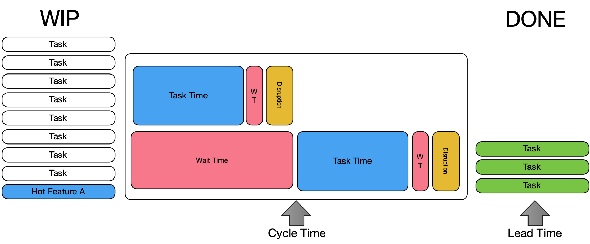
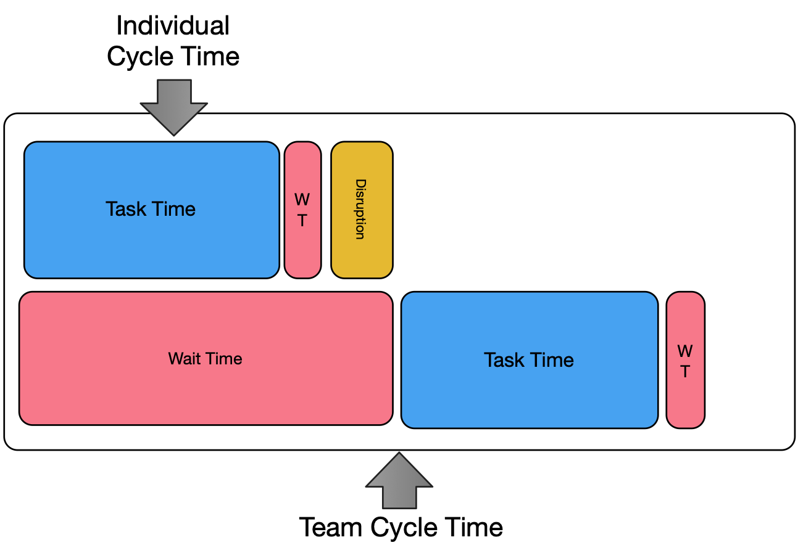
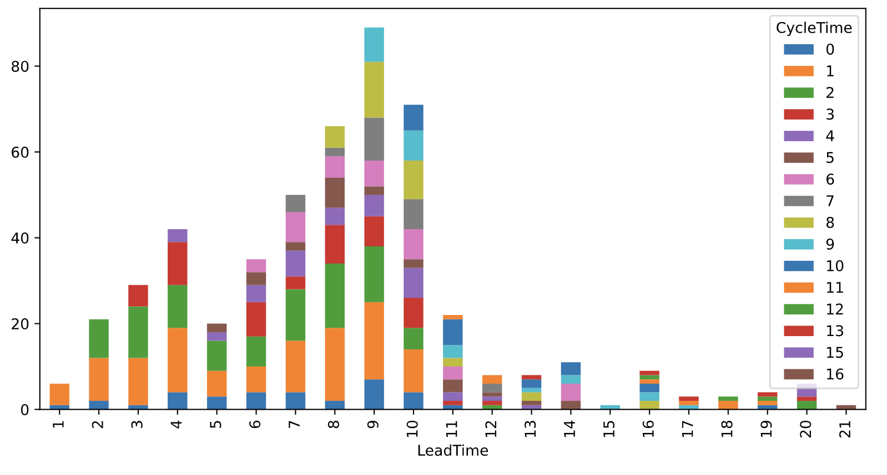
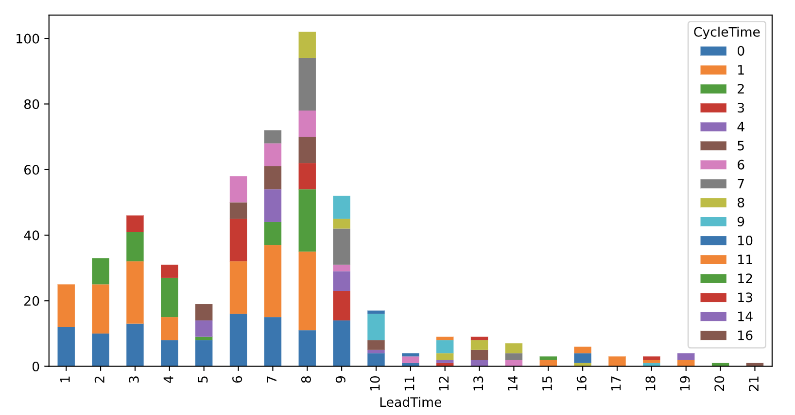
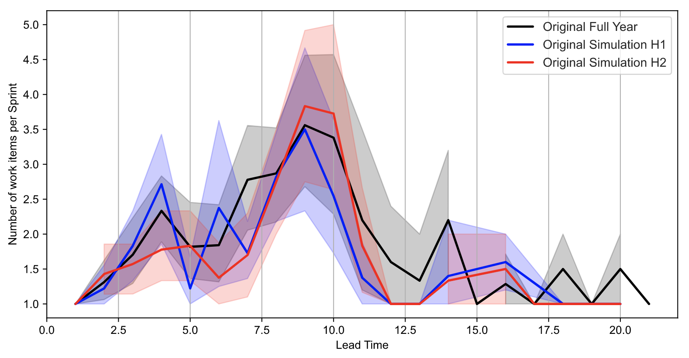
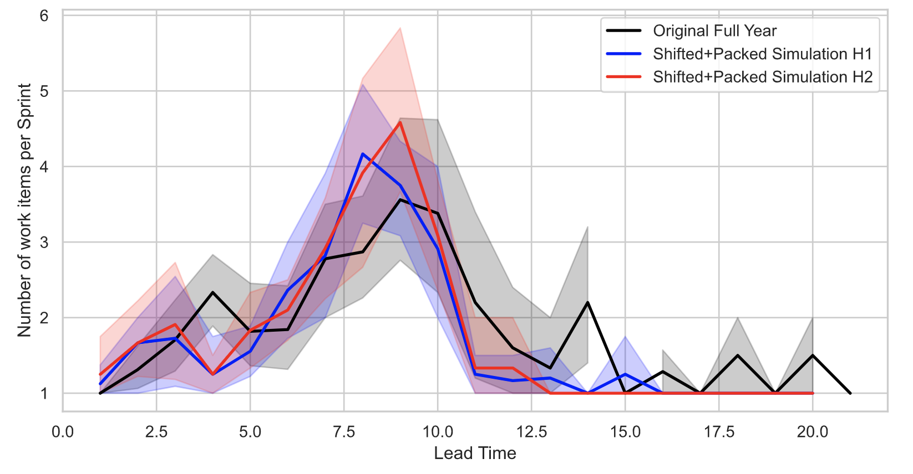

# Rejuvenating Agile operations by putting Lead and Cycle Time front and centre

## Contents
* [Introduction](#introduction)
* [Knowledge work is not Manufacturing](#manufacturing-is-not-knowledge-work)
    * [Manufacturing](#manufacturing)
    * [Standard work - Assembly Line](#standard-work-assembly-line)
    * [Non-standard work - Craft production](#non-standard-work-craft-production)
    * [What makes up knowledge work](#what-makes-up-knowledge-work)
    * [There is no single queue](#there-is-no-single-queue)
    * [Implications on craft production](#implications-on-craft-production)
* [Goals are still the same](#goals-are-still-the-same)
    * [Cycle Time](#cycle-time)
    * [Lead Time](#lead-time)    
* [Craft Production - Learning to see](#knowledge-work-work-flow)
    * [Your individual work](#your-individual-work)
    * [Optimised by department](#optimised-by-department-team-work)   
    * [Optimised by work](#optimised-by-work-team-work)  
* [Craft Production - Speeding it up](#craft-production---speeding-it-up)
    * [Hypothesis-based mindset for improvements](#hypothesis-based-mindset-for-improvements)
    * [Visualising Lead and Cycle Time](#visualising-lead-and-cycle-time-improvements)
    * [Get story value and size right](#get-story-value-and-size-right)
    * [Reduce handovers](#reduce-handovers)
    * [Work needs to be planned](#work-needs-to-be-planned)
    * [Quality throughout](#quality-throughout) 
    * [There is more...](#) 
    * [Visualising Lead and Cycle Time Improvements](#visualising-lead-and-cycle-time-improvements)
* [What is Agile](#what-is-agile)
* [Conclusion](#conclusion)
* [Acknowledgments](#acknowledgments)

## Introduction

Agile methodologies such as Scrum, Extreme Programming and DSDM have emerged in the 1990s and most of them were inspired by the Lean Manufacturing movement. Majority of the methodologies follow similar values but are delivered in a different way. Unfortunately, Agile methodologies are experiencing the following problems:
1. They were inspired by the manufacturing industry, software engineering is not manufacturing as it follows different paradigm. This renders some of the lean techniques not as effective in knowledge work. 
1. Multitude of key performance indicators make it hard to realise what is the "key" indicator further reinforcing entropy. Additionally, KPIs usually don't provide any very much needed insight into what needs to be done to improve operations. This is because focus is on methods and not the results. 
1. As they are so prescriptive new practitioners have to spend a lot of time practicing Agile methods. After a lot of practice, they can follow rules and understand what needs to be done, but not why they are doing it. 
1. They value **how** you work (methods) over what gets the results, this makes it very hard to understand what needs to be changed to make methodology work for your particular environment. 
1. They need to integrate with the whole business way beyond Software Engineering, this includes Marketing, Sales, Customer support, etc. Due to difficulty in achieving this, departments choose to keep their improvements to themselves, leading to a local optimisation, meaning organisation as a whole fails to get overall benefits. 
1. Term agile is not well defined, it is hard to understand what is meant when stakeholders say, "we have to be more Agile" or "we need to change our process to be more Agile".
1. In time entropy erodes established best practice, making practitioners lose their "true north" bearings. It also makes it really difficult or not even possible to go back to "true north" if stakeholders lose faith in the existing process. 

In this article it will be explored why some of the manufacturing methods are not relevant to knowledge work and how above problems can be remedied by focusing on Lead and Cycle Time.

## Knowledge work is not Manufacturing

Agile methodologies do borrow ideas from lean manufacturing and engineering. While some ideas such as standards, components, trunk-based development, and value streams have been very useful, others such as Kanban, Theory of Constraints (ToC), Little's Law and one-piece flow get applied wrongly. As a practitioner I have immersed myself in these concepts by reading books such as "Agile Management for Software Engineering", "Learning to see value-stream mapping..." and "Phoenix Project", and for a while I was under impression that these concepts were working. Only after some reflection it became evident that these ideas did not work as expected, they actually ended up slowing delivery operations which lead towards a lot of frustration. In this section we will explore why exactly ToC, Little's Law and one-piece flow can't be applied literally.

I am not an expert in manufacturing, so this section's examples should be taken as high-level ideas that serve as a contrast to knowledge work.

### Manufacturing 

Since the rise of Lean Manufacturing majority of companies have transitioned towards one-piece flow. This is where work travels in discrete pieces from station to station where some specific operation is applied on to it such as:

(Figure 1, Image taken from https://www.kaufmanglobal.com/glossary/single-piece-flow/)

This means that factories tend to have one assembly line down which work travels. Takt dictates how much time each station has to complete their task. For example, in car manufacturing, you might need to install car dashboard, you will be given 3 minutes per car to do this. If you find an issue or don't have enough time you can "stop the line" so the entire assembly line stops. 

(Figure 2, Charlie Chaplin "Modern Times" 1936 movie)

Car manufacturers have been doing this for decades so they have figured out ways to ensure that each station has as few issues as possible so there is very little disruption. Having said that there are thousands of line stops a day and this is considered healthy and normal.

Assembly lines stages can get very long, and they might have number of inputs before the work gets merged into a single line. This can be witnessed when car manufacturers perform "marriage", this is when they insert the chassis, transmission and engine in the body on the production line. 

(Figure 3, Image taken from https://www.sar.biz/news/2017_Aggregateeinbau_BMW_e.asp)

Lastly all of the cars are not the same. They will be built per different specifications. Some will have premium interior, different wheels, upgraded electronics and so on. This means each stage needs to know what exactly needs to be done for that particular car. This adds additional complexity to the manufacturing process. 

Now that we know some of the pertinent details we can explore why **assembly line work** is different to **knowledge work**.  

### Standard work - Assembly Line
What gave a drastic productivity boost to assembly line is componentisation. It became possible to put things together using discrete parts. Componentisation and part integration is possible through agreed standards i.e. interfaces. Assembly line is setup and configured to produce similar models of the car, sure these models have different specifications like mentioned above, however they are all standard and their **Takt time is known**. 

### Non-standard work - Craft production
Now contrast this to software engineering. Typical backlog of user stories delivers discrete piece of value, we will call them story A, B and C. Story A might take 15 days to complete by 4 people. B might take 5 days to complete by 2 people. C might take 8 days to complete by 7 people from 3 different departments! In some sense this is craft production. 

Practitioner might say, well how about you break these user stories down to a smaller size so that Takt time is known? I have to counter with this, a user story needs to be a discrete piece of **real** value. If it is possible to break it down and still delivery **real value** then it should be broken down. However more often then not user story can only be broken down to a finite amount until it **loses its value** and then process becomes task break down. Breaking user stories down too far is artificial and actually leads to knowledge workers forgetting why they are doing the piece of work in the first place, this leads to poorer solutions and time waste as we will later find out from the Lego experiment.

Wait, what on earth is craft production?

"Regardless of the product, craft production’s finished goods are unique, tell a story, and (should be) made of extremely high quality, which is the biggest appeal of purchasing something from a craft manufacturer. 

However, even though customers are interested in these unique items, it does come with the disadvantage of being harder to repair compared to the mass-produced, cheaper alternatives, which are composed of identical, replaceable parts, that are easier and cheaper to fix.       

The other thing about craft production is that it’s reliant on a highly skilled craft worker, of which we’re currently experiencing a shortage. Training for anyone working in craft production can be intensive and delivered through apprenticeships, workshops, lectures, or just a simple hands-on approach." - 
Craft production segment from [Katana](https://katanamrp.com/blog/craft-production/#:~:text=What%20Is%20Craft%20Production%3F,when%20making%20pottery%20by%20hand.)

This is not to say that there is no standard work in knowledge work world. Implementation’s consultants that are setting up a product for a customer are doing some standard work. Software engineers that are re-using components and connecting them to a different data source are doing some standard work. However, the problem is that companies want innovation and product differentiation. Unfortunately, this work falls into craft production which is unique and not easily repeatable which makes it slower and less predictable. 

Standard work in knowledge work can be automated fairly easily thus leaving us once again with craft production work. Having said that, for foreseeable future there will always be some standard work that people will need to perform. This is because it is cheaper to have people do it, or it is customer friendlier. This is where existing Lean Manufacturing techniques can be applied literally. 

The rest of the article focuses on craft production type of work only, we will see how by focusing on Lead and Cycle Time it is possible to make work more predictable, faster and more enjoyable for everyone involved.

### What makes up craft production

It might sound strange, but Craft production delivery predictability is exacerbated by the fact that **people** are working on the actual work. Stakeholders in organisations forget that employee A and employee B might deliver work at very different speed due to their different characteristics and experience. Here are factors that impact knowledge work productivity:

(Figure 4)

* Volume of work - This is the amount of work you have to do. 
* Unknowns - This is you identifying stuff that you did not consider when you were estimating the work.
* Complexity - This is you figuring out an algorithm to solve a problem, the main thinking part. 
* Risk - This is how much testing you have to do given the risk level that is acceptable for the task at hand.
* Skill - This is you improving your hard/soft transferable skills (programming, math, architecture, algorithm design, management, leadership, etc) or using your existing skills to get work done quicker.
* Domain - This is you gaining new domain knowledge (HR, Logistics, Financial Trading, etc) or using your existing domain knowledge to get work done faster.
* Attitude - This is how you perceive your work environment and tasks.
* Aptitude - This is you having developed or have predisposed skills towards the work that you are doing.

### There is no single queue

Assembly lines tend to be linear. Once work enters the production line it enters a queue and goes from start to the end, this is called work in progress (WIP). This is not the case with knowledge work. Work might go on to a backlog sit there for a year and then get removed. Work that once was super urgent will be deprioritised and swapped with something else. In knowledge work there is no queue as such. If you are following Scrum, then normally team commits to work before a Sprint starts and very rarely should user stories in the Sprint change. This commitment is probably the only place in the whole process where there is a stable queue, and these **commitments** (items that are scheduled to get done) can be called **work in progress (WIP)**.

### Implications on craft production

Rest of this article explores implications of the above, however few things will be pointed out at this stage:
1. **Little's Law** assumes that queue is stable (there is WIP) and that work has an average cycle time. This is true for standard work as work on average takes similar amount of time, this not true for craft production. This means out of the box Little's Law can't be used in software engineering. This is explored further in "Goals are still the same".
1. **One-piece flow**, typical Scrum team has around 6 team members. It is likely that they will work on more than one user story at the time. This means it is not one-piece flow. Constraining team to a one-piece flow artificially constraints teams and wastes capacity. This is explored in "Get story value and size right" section.
1. **Theory of constraints** assumes that there is one-piece flow and work is standard. Different stories will engage different people in the team at **different times**. This means bottleneck is **dynamic** and it depends on what that team is working on. 

One big insight that we can gain already is that in the craft production the **work it self** can be a constraint. This is because you can choose:
* What you do
* How you do it
* Who does it

This means if you have a creative product owner or business analysts, they can deliver astronomical amount of value with a very small team. This is because they can swarm around "problem" that needs to be solved and figure out creative ways to getting it delivered quickly. With craft production you are not constrained to the assembly line, people are not machines as they can learn, help each other and be creative. However traditional manufacturing mindset would dictate that you need more capacity and people to deliver more **units of work**. This is not true for craft work but it is true for standard work.

## Goals are still the same

Your business goals are still the same as in the manufacturing. It cares about delivering quality innovative solutions to the customer. This is typically measured in lead time and cycle time. Lead Time is a customer centric metric, while cycle time is an internal process metric. Lead time measures how long customer has to wait to get something, and cycle time measures discrete process speed, how strange is it that some businesses do not actually measure this? To be clear, I am not talking about speed of a single department getting from point A to B either. I am talking about getting from point A, customer commitment, to Z customer receive their functionality. That is work traveling through the **entire** business. In this section we will explore these two variables and how they can help your business. 

### Cycle time
Let's go back to the car manufacturing where I have mentioned Takt time. Cycle time is different to Takt time. Takt time tells you how much time you have to complete a discrete unit of work given amount of demand. Cycle time tells you how much time you have used to perform a unit of work. Cycle time can be measured at every level, but what does that mean?

Let's say you have entered a coffee shop, and you have finally reached the till to make that drink request. Cycle time starts from the moment barista smiles (hopefully) and asks you for your coffee order and it ends when they shout your order or name. That time that was taken to make your drink is cycle time. You can also measure Cycle time at lower levels, for example how long did it take to take your order, how long did it take to make your coffee and then what was the cycle time overall.  

Coming back to the world of software engineering. User Story will have an overall cycle time i.e. days or hours to complete and this is measured from story activation to story completion. Individual tasks under that story will also have cycle time that are measured from activation to completion. Task cycle time is important as their cycle time will ultimately dictate the overall user story cycle time.

(Figure 5, X axis shows number of days it taken to complete a piece of work, Y axis shows number of stories in that group)

### Lead time 
This is the most confusing one when it comes to knowledge work. Lead time is how long work has taken from the moment it was committed to the queue. So, the overall time. Let's go back to the coffee shop example again (standard work). When you have entered the coffee shop you have committed yourself to the queue, the overall time it takes you from walking into that door to the moment you walk out with nice flat white is the lead time. 

You might be thinking well there will be a lot of waiting around before I get served and my cycle time starts! You are right, the cool thing is that in "standard work" you can predict how long you will wait in the queue. This is because there is **average** cycle time. Let's say it takes 1 minute give or take to make a cup of joe. So, if there are 4 people ahead of you, that is 4 people are work in progress, you know that you will get your coffee in about 4+1(+1 is for you) multiplied by 1 minute so 5 minutes.

Going back to software engineering. Work gets committed normally in the Sprint so that is when the lead time clock actually starts. If you are using Kanban and work does not get swapped around all the time (stable queue) then lead time is measured from the moment is committed to your Kanban board. Issue is that in software engineering cycle time is heavily skewed, see figure 5 and this makes estimation less predictable. This is because unlike coffee that might take between 30 seconds to 1 minute and 30 seconds which makes it 1 minute average. Based on above graph ~25% of knowledge work gets delivered in 2.5 days, ~50% 7 days, ~75% 10 days and last 25% 15 days. So it seems that craft work can't be standardised in to **average** unit of time like standard work can be which means out of the box Little's Law can't be used. 

(Figure 6, showing you committed work WIP, cycle time and lead time)

## Craft production - Learning to see
Knowledge workers typically work together to produce some value. The moment team is formed dynamics change, and I don't mean this from personality point of view but from work **relay** point of view. 

### Your individual work

Three factors that make up your **individual** work:
* **Wait Time** - This is when you are waiting around for some knowledge that you don’t have, decisions that you can’t make and finally you are waiting around for someone else to complete some work before you can start yours.
* **Disruption Time** - This is when you have to expedite some work, rework some work, corporate interruptions and mental health impact.
* **Task Time** - Finally, this is the actual work that you are doing, pure sitting down and getting things done.

(Figure 6, factors that make up your actual work)

### Optimised by department

Imagine you are working on your own on your own start-up. You will have very little wait and disruption time. You are on our own, you can make all of the decisions. Also, if you are lucky enough to work in a quiet environment you should experience very little or no disruptions. You get things done fast, your users are impressed with your company, new features just come out all the time. In this case you are in "your individual work" scenario. 

However, this changes the moment you hire your first employee in your start-up. The moment you do that, you create an organisation, that means you have created a system. In the system work no longer gets done by a single individual, it gets done by many individuals. You as the founder are unlikely to feel much impact by hiring this new person (apart from the knowledge transfer burden), but if you are not careful your new employee will have to wait for your decisions, knowledge and task allocation. Their wait time will grow as they wait for you, and they will probably be disrupted by you. You will wonder why they are not as a productive as you, it might be because they have not got enough autonomy to make decisions as they don’t know your values, so they don’t know what decisions to make on your behalf or maybe they are not getting enough clarity about the desired outcomes. Most people are not founders, they are the employees and sometimes they don't see the "decision making framework" that founders use. 

(Figure 7, showing how work dynamic and cycle time changes the moment another team member gets involved)

Now image that your company grew too quickly, and it ended up not following any Agile process and instead it had departments of people per discipline. So, Web devs in one department, API Devs are in another department, you get the point. Each department will have their own backlog, which means everyone has their own lead time, on top of that all individuals will experience disruptions (team meetings, urgent requests you know the drill) and there will be many handovers from one department to another. Work will also end up traveling backwards due to misunderstandings, some people would call this a waterfall organisation and it looks something like this: 

(Figure 7)

If a customer has requested a “Hot Feature A” they will have to wait for a long time for this work to travel through this type of organisation (system). Actual task time for "Hot Feature A” might be 12 hours of work in total, however given all of the wait time (handovers and lead times) and disruptions it might take up to 1 month before it gets shipped. There is a big difference between 1 month lead time and 12 hours task time. Your customer will not care about the 12 hours of task time, they will just care that you took 1 month lead time. Overall, in this type of organisation lead time for most work will be very high, fewer projects will be shipped, projects will very rarely go out on time and individuals will feel frustrated as there will be a lot of firefighting.

### Optimised by work
Now imagine that your company’s founder understood importance of lead and cycle time and worked to remove as much wait, disruption and task time from overall delivery process. They have decided to sit people together for a finite amount of time to deliver certain features and projects. They have done this as they want to remove handovers, the amount of project management is required, competing agendas, waiting for decisions, knowledge and organisational dependencies. They work as a team on one story at time (as much as possible) and their main job is to push that one story through the system as fast as possible. Now, that story that took 1 month to deliver, in this new system will take 12 hours or even less. This is because you have removed all of the waiting around, disruptions (team lead and product owners act as defenders) and because this team is sitting together, they can actually expose the unknowns faster, tame complexity, share their experience and share the burden of the work so they can actually deliver the work faster. This structure would look something like figure 8.

(Figure 8)

## Craft Production - Speeding it up
By now we know that lead and cycle time is comprised of wait, disruption and task time and it all of these factors get exacerbated by departmental teamwork. In this section we will explore how it is possible to reduce cycle time. 

### Hypothesis-based mindset for improvements
Lead and cycle time give us something that Agile methods on their own don't. Ability to run experiments and measure something tangible. It is possible to form a theory let's say that "writing unit tests will reduce lead time but will increase cycle time" and actually test this theory. By using lead and cycle time it is even possible to predict the impact of a proposed change and avert bad management decisions, or at least be able to measure their impact when they go wrong. Lead and cycle time give managers a decision-making framework for process changes.

Plenty has been written about hypothesis-based thinking and if you have not come across it before, please do explore it. I also explore it in my ["Focus on results, not methods"](http://www.zankavtaskin.com/2020/08/lead-time-driven-delivery-focus-on.html) article. 

### Visualising Lead and Cycle Time

To measure lead and cycle time we can't use average metrics, this is because they don't fall into average (see figure 5) as work is skewed. This means we have to use different methods to measure lead and cycle time. To bring this home take a look at this stacked bar char:

(Figure 9, X axis shows you which day work has arrived and colors represent how big item is, Y axis shows number of stories)

This bar chart shows us all user stories lead time and cycle time for the past year. This team follows a 2-week Sprint pattern. As we can see majority of the work gets delivered towards the end of the Sprint. We can see that there are user stories that drift across Sprints as they don't get finished in a single 2-week Sprint.  

If you would like to measure this, you are better off using quartiles. With quartiles it is possible to explain above graph by saying ~25% of the work gets delivered by day 5, ~50% of the work gets delivered by day 8, ~75% of the work by day 10 and the last ~25% by day 21. 

### Get story value and size right

I have been fascinated by one-piece flow and small batches for a long time, this is of-course due to weird obsession with Lean Manufacturing. One afternoon when it was almost home time I have asked few of my colleagues to participate in a game that would "prove" that one-piece flow is an optimal strategy for delivering software. 

Experiment had to be quick to setup and easy to follow, after all everyone wanted to go home. The following rules were established:
* There will be two teams of same size
* There will be two backlogs of stories with acceptance criteria; one backlog was broken down to tiny discrete stories, "build a chair", "build a table" and "build a plant". Second backlog had larger stories with more scope "build a park scene with chair, table and a plant". There were many different scenes in there that teams had to create. 
* Each team member was constrained as he/she could only work on structures top, middle or bottom part and not the whole. This constraint reflects skill/specialism in real life.

Hypothesis was that smaller scope stories backlog would outpace larger scope stories. Theory was that larger stories create more conversation, errors and by having many stories on the go at the same time would slow down overall delivery. 

To my surprise the completely opposite was true. Team with larger stories knew what they were doing overall as they have spent time discussing overall story, theme and ideas on how park scene with chair, table and a plant will be setup. This has reduced task time, as they have worked a team to figure out best approach, it has reduced future disruptions as they knew who was doing what and why they are doing it. As plenty of work got released into the system there was no need for anyone to wait for any work. Team overall felt calm, self-organised and positive.

(Figure 10, Large story team delivering a park scene)

Now compare this to one-piece flow team. This team was given one piece of small work to develop at the time such as chair. They did not know the overall theme of the work, that is that they are building a park scene. They only understood the scene as they were finishing it, so they have tried to make it better by reworking it, this created wait time and disruption. As it was one-piece flow, many members just stood around waiting for work, thus increasing wait time. This team also needed a lot more orchestration as they did not know the context of the work (increase in task time, wait time and disruption) and overall team seemed more stressed. 

(Figure 11, Small story team delivering a park scene)

I don't know why I was surprised. Large story team has outpaced one-piece flow team by 26% average and delivered much better quality work! 

Now dear reader, let's refer back to my earlier statement in this article "Constraining team to a one-piece flow artificially constraints teams and wastes capacity" and "user story needs to be a discrete piece of value". 

**First insight** is that batch sizes need to big enough for teams to understand what is that they are doing. This way they can get engaged with the work, provide an opinion, self-organise so that everyone is utilised, know what work is coming in when, provide assistance to other team members where appropriate. If user story is too small, it robs the team of doing all of the things just mentioned and story is probably broken down too much and it is more of a task. If you follow INVEST and ensure that stories are actually valuable, that is they deliver discrete piece of usable functionality then you are mostly there.

**Second insight** is that work planning and team communication reduces cycle time and reduces lead time. This is important as knowledge work is all about ideas exchange and not just typing on the keyboard.

**Third insight** refers us back to section ["Implications on existing best practices"](/#implications-on-existing-best-practices) that "in the craft production the work itself can be a constraint. This is because you can choose what you do, how you do it and who does it". 

### Reduce handovers
Knowledge work organisations are plagued by handovers, refer back figure 7. Handovers are normally required for 2 reasons: 
1. People doing the work don't have the skill to perform the whole task, so it needs to be handed over to the next specialist 
2. There is separation of duties due to security, hierarchy or politics.  

Handovers are very time consuming, however I was not sure if this is actually the case or was it my bias talking. So once again I have run a game experiment. This time it was a much larger experiment, over 70 people participated in about 8 teams. Experiment rules were:
1. There will be teams with same amount of people in each team
1. All teams had ship 10 letters and they had to follow the following standard work process for each letter, Dispense, Left Fold, Right Fold, Place into the envelope, Stamp, Check and Complete. 
1. During first experiment participants in each team could perform only 1 task and they could choose either batch flow or one-piece flow. Most teams choose one-piece flow as it engaged more team members faster, that is it reduced wait time for all participants. 
1. During second experiment participants in each team could perform as many tasks as they wanted, the only rule was that tasks had to be completed in the specified order. 

Average time for first experiment was 42 seconds. Average time for second experiment was 12 seconds, 3.5x improvement. What was really fascinating that for first experiment teams were told to follow standard assembly line process (figure 1). For second experiment they were given only standard work process rules (2) and were given time to figure out their optimal team setup. Most teams have converged to the model where each person performs the whole process on their own, no handovers at all. That ended up being the winning strategy. 

Main insight is that handovers increase wait time and increase task time. When one person can perform the entire task from start to end it might take them longer overall then doing just one part of the process but the whole process **collectively** is much faster. This is because utilisation is increased as no one is waiting for work and task time is reduced as handovers are no longer part of the work.

This is why it is important to train your staff so that they can become full stack engineers and giving everyone in your organisation ability to self-service, that is Software Engineers can look at the production logs, perform software releases independently, get access to all of the relevant information and so on.

If you decide to repeat above experiments in your own organisation, please do share the results. 

### Work needs to be planned

Due to volatile nature of knowledge work as normally there is no "single organisational queue" and very little standard work. It is important that sponsors know what is currently being done, what is going to be done next and what is the long-term vision. Without this top-level agreement, disruption can run havoc across an organisation as work get prioritised and deprioritised (work swapping). You know it is got bad when Scrum teams can't even plan a 2-week Sprint, or if they plan it and by the end of what they have delivered is different set of stories as they all got swapped. I don't know about you, but to me that is not Agile, but chaos, more on that later.

For this reason, project management and planning are necessary part to get an agreement with customers, stakeholders and sponsors. Ideally you want to move your organisation towards figure 8 to remove project management and planning as much as possible. If you are working in a large organisation project management is inevitable even if your organisation is optimised for work. Someone needs to coordinate work that is being done by many teams this is because work needs sequencing and dependency mapping.

What does all of this mean in practice? To reduce disruption and wait time we need to: 
* Prioritised backlog must exist 
* Dependencies must be removed as much as possible so that teams can work independently on their own backlogs and not be part of any project
* If project is required (cross team coordination) then project's dependencies and everyone’s required contribution must be known
* Work needs to be delivered just-in-time. If you are working on something that is not needed right now, this means other work's lead time is growing! 
* If specialist teams exist (component teams) they must prioritise global work over their local work. 
* If specialist teams exist then there must be a global roadmap of work so that they can get ahead of the curve be ready for just-in-time handover 
* Just enough of roadmap and backlog planning needs to be done that is not too much or too little. Your organisation needs to find the sweet spot. 

To be clear I am not saying that user stories need to be planned 3 months in advance, that they need to be broken down to a task level and allocated to a specific person with exact number of hours they have estimated for it. This is extreme and very wasteful. However, another extreme would be people not knowing what is needed of them, there are no stories and work is swapping every single moment of the day and wrong software is being delivered. 

A lot of people don't find above exciting, however if you work for a large organisation this orchestration is an absolute must to reduce lead time for work inflight. This section is probably going to be the most controversial one with Agile community. 

### Commit to less 
The simplest solution to reduce lead time is to commit to less work so that there are less things in the queue waiting (reduce your WIP). This is the hardest thing to do as this involves saying no and creating a slack in the overall system. 

When I say no, it means no to new work or contracts. Letting go of customers that are no longer your speciality. Saying no to features that don't seem like a right thing to do long term.

If it is common that your company expedites work to meet a customer demand, then maybe this should be embraced. Create space in teams schedules for urgent work of a certain size. If nothing comes well then team can pick up next thing of the backlog, otherwise there is space for it. Generally speaking, it is healthy to create a bit of slack in the overall system so that teams can help each other out day to day. If everyone is high-strung due to over utilisation teams can't help each other and processes start to erode.  

By saying no, focusing and creating slack urgent work can travel through without interrupting existing commitments thus reducing or maintaining existing lead time.

### Prioritise global work over local work

This section applies to specialist teams. Across the industry it is common to have Software Architects, Software Principals or a Data Scientist department. Sometimes delivery teams that have committed to deliver something rely on some expert department to help them. It is vital that these specialist teams prioritise globally committed work over their own local work. To achieve this specialist teams should not make concrete commitments or create plenty of slack to avoid local and global lead time increase.

(Figure 12, Bruce Almighty making way for global work over local work)

### Quality throughout
 There is one thing that can drastically increase lead time unexpectedly. This is unplanned disruption. Typically these are bugs that appear in the form of unexpected behaviour in the software or process bugs that manifest themselves as something important being missed or something not being accounted for. Too much of unplanned disruption can erode trust and confidence in the process. It is important to minimise unplanned disruption as much as possible so that it is exceptional. This can be achieved by putting quality in your process and putting quality into your software.

There are number of ways to put quality into your process. For example, Definition of Done and Ready are checklists that are used to ensure that Backlogs and Sprints are in the expected state. Having a release pipeline down which your work travels and gets checked either manually or automatically is another one. 

Putting quality into your software is covered well in DevOps literature. Normally this means quality automation tests exist that cover end to end testing, unit tests, performance tests, accessibility testing and so on.

Key thing is that your organisation iteratively invests into quality as this only one of the ways to achieve long term predictable and sustainable performance. If you would like to read more about this topic check out my [stabilise through embedded testing](http://www.zankavtaskin.com/2020/09/lead-time-driven-delivery-stabilise-and.html) article.

### There is more...

There are hundreds of ways that lead and cycle time can be improved. This article does not provide a complete list. However, I would be remiss if I did not provide few honourable mentions:
* "Shift-left testing" to reduce wait time
* Empowering teams to make local decisions and create knowledge locally to reduce wait time 
* Team leaders and managers that are there to resolve daily operational issues to reduce wait, disruption and task time, see [this article](http://www.zankavtaskin.com/2018/08/applied-software-delivery-hidden-impact.html))
* Converting Craft production to Standard work through automation, standards and component reuse to reduce task time
* Talent retention to reduce task time 
* Microservices for work parallelisation, wait and disruption time reduction 

### Visualising Lead and Cycle Time Improvements
Earlier we saw how it is possible to visualise and describe lead and cycle time, but what do you if you want to measure improvements? Let's say you set a goal to reduce cycle time by 1 day average. How would that look like and compare to Figure 9?
Now's let imagine that your team has achieved it is goal, here is how your new distribution would look like:

(Figure 12, Cycle Time was reduced by 1 day average and more work added to fill space)

Let’s take a moment and unpack what has happened. When we say we will reduce cycle time by 1 day average this means that some stories will not be reduced at all, some stories will be reduced by 1 day and some by 2 days, this will give us 1 day average. Finally, if you have shifted cycle time by 1 day average this means your team has created more space for more work. This space will get filled with more work of remaining size, above figure takes this in to account. Originally team has delivered 505 user stories in 1 year, after 1 day cycle time reduction it is forecasted that team will deliver 668 user stories. 

This is all great, but it is possible to get ahead of yourself and see improvements when there are none. If team happens to deliver more stories three Sprints in a row does not mean they have improved. It might mean that team was “regressing to the mean”. Take a look at this visualisation:

(Figure 13, X axis shows day when work was delivered, Y axis shows number of stories delivered on that day)

Black line represents the actual delivery and faded black variance around each day. Red and blue lines are randomly sampled from existing data. This means some stories are randomly chosen from available collection of stories and then blue and red lines are drawn. Important thing to understand that it is exactly the same data. If you look at the blue line, it might make the team feel that they are delivering work earlier in the Sprint and being more stable. This is not the case, it is **a random result**.

Here is how actual improvement would look like:

(Figure 14, X axis shows day when work was delivered, Y axis shows number of stories delivered on that day)

If you refer back to the Figure 12, we know that more work gets delivered and it gets delivered earlier. Black line represents original data Figure 13, blue and red now show an actual improvement, but notice how similar it still is! This is because it still is similar as team has reduced cycle time only by 1 day average. Having said that, if data is collected for 1 year (there are enough samples) and Figure 14 has emerged then some would say that it is reasonable to assume that there was an improvement. 

If you are interested in more detail or want to see code behind this, please check out [this](https://github.com/zkavtaskin/Lead-Time-Driven-Delivery-Simulation/blob/master/Notebook/LeadTimeDynamics.ipynb) notebook. 

## What is Agile

If I critically think about it, I don't fully know what Agile means, before you read the rest of this section, have a think about it as well. What does it mean to be Agile? 

During a presentation I have asked a group of people what it means to be Agile. I had many answers such as "respond to market change", "working with the customer", "software development over bureaucracy" and so on, all answers were derivatives of Agile Manifesto. One person even said that answer is in the Agile Manifesto. So, it seems that Agile is set of intangible characteristics that are defined by the Agile Manifesto. 

Issue is that Agile Manifesto "characteristics" are vague. Due to this quiet quickly it becomes almost a spiritual discussion of what people believe. To illustrate my point, recently I have read the article by Jeff Gothelf where he said that SAFe framework is not agile because SAFe is missing: 

"Continuous learning and improvement, customer centricity, humility, cross-functional collaboration, evidence-based decision making, experimentation, design and course correction — to name a few — are visibly absent from the SAFe conversation. Instead, organizations adopting this way of working focus on rigid team structures, strict rituals and events and an uneven distribution of behaviour change requirements depending on how high up one sits in the organization."

Jeff is not the only one to say above, there is a lot of debate out there about what it means to be Agile. Problem is that this kind of debate mostly happens when people argue over vague ideas. If Agile definition was concrete there would be no argument, people would not agree with the exact definition, and they would invent the new concrete thing like "Flex Manifesto". Instead, we debate over what something is and is not. This is of-course a colossal waste of time because the subject matter has no **concrete** definition. 

Could it be that Agile is like a diamond, and it is missing the perfect setting that would make it shine? What if we keep using Agile methodologies but we start measuring and caring about lead and cycle time as much as companies measure and care about revenue and profit. I mean really care about it. What if you hear things like "Lets develop this iteratively so that our lead time is low" or "Lets establish work team to reduce handovers and drastically reduce our cycle time and overall lead time". Best thing of all it can be measured and visualised. It drains all of the vagueness, making it very concrete. Would our industry benefit from moving conversation away from "being Agile" to "reducing lead and cycle time"? 

## Conclusions 

Knowledge work in software engineering is akin to Craft Production. Lean Manufacturing methods can't be used literary when dealing with Craft Production. In Craft Production the work itself can be a constraint as you can choose what you build, how big it is (Figure 5), how you build it, who builds it, how people work and how motivated they are in getting the work done. All of this impacts lead and cycle time, and it is measured using quartiles. This is not the case in Manufacturing where workflow is pre-configured, machines or people do one thing repeatedly and work can be measured using average distribution. 

Craft production cycle and lead time can be drastically reduced if everyone focuses on minimising wait, disruption and task time. There are hundreds of ways that this can be done, to summarise:
* Product Owners sizing stories right and Software Team Leaders engaging all team members in delivering one story at the time as much as possible to reduce lead, task and wait time
* Backlog, project, priority and dependency planning to reduce disruption and task time
* Creating space for unplanned work to reduce disruption and wait time 
* Reducing handovers through cross skilling team members and providing them with self-service access to as many corporate systems as possible to reduce wait and task time
* Getting everyone in the company to prioritise global work over local work to reduce wait time 
* Embedding quality into the overall engineering process and product itself to reduce disruption and wait time
* Managers motivating and protecting teams from disruption as much as possible to reduce task and disruption time

Just like Manufacturing has gone through a lean revolution, Craft Production will go through it too. It will eventually converge us to some scientifically proven non vague standard that will become accepted. It might be, that what will stop the Agile debate is putting lead and cycle Time at the front and centre of what your organisation does. In this world Figure 8 “seems” to the optimal model: 

(Figure 8 repeat)

This article's intent is not to provide complete analysis and methodology, but to kick start conversation and provide some alternative thoughts on Agile practice. If you like this article then check out the less refined material that was used to create it [Lead Time Driven Delivery](http://www.zankavtaskin.com/2020/09/lead-time-driven-delivery-introduction.html) Series.

## Acknowledgments
This article has been long time in the making. Journey has officially started around 2013 when Andrew Bray gave me a copy of the Phoenix Project. MHR's leadership team has been most accommodating by allowing our software teams to experiment with various ideas and approaches throughout the years. Special thanks for that goes to  Anton Roe. Thanks to MHR's People First software development team for contributing ideas, participating in experiments and trying ideas in practice. Special thanks to Philippa Jennings and Hannah Jeacock for reviewing the article and Joe Norley for bouncing quantitative ideas off. 

